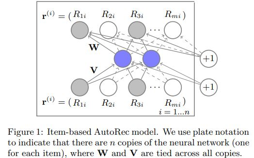
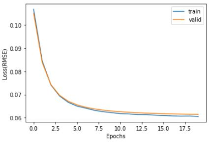

# AutoRec-tf2
It's an unofficial implementation of AutoRec in TensorFlow 2.0+.

Original Paper: ["AutoRec: Autoencoders Meet Collaborative Filtering, 2015"](http://users.cecs.anu.edu.au/~u5098633/papers/www15.pdf)

# Introduction
The original paper uses only one hidden layer in both the encoder and decoder.



In this practice, we use two hidden layers to see how it performs on the MovieLens-1M dataset.
```Python
def getEncoder(numOfInput, numOfHidden1, numOfHidden2):
    x = tf.keras.Input(shape=(numOfInput,))
    out = tf.keras.layers.Dense(units=numOfHidden1, activation='sigmoid') (x)
    out = tf.keras.layers.Dense(units=numOfHidden2, activation='sigmoid') (out)
    return tf.keras.Model(inputs=[x], outputs=[out])

def getDecoder(numOfInput, numOfHidden1, numOfHidden2):
    x = tf.keras.Input(shape=(numOfHidden2,))
    out = tf.keras.layers.Dense(units=numOfHidden1, activation='sigmoid') (x)
    out = tf.keras.layers.Dense(units=numOfInput, activation='sigmoid') (out)
    return tf.keras.Model(inputs=[x], outputs=[out])
```

The loss of tarining and validation dataset during training.



# Requirements
Python 3.6+
```sh
$ pip install -r requirements.txt
```

# Reference
* https://vitobellini.github.io/posts/2018/01/03/how-to-build-a-recommender-system-in-tensorflow.html
* https://github.com/npow/AutoRec

# Future work
- [ ] Add hyperparameters selection
- [ ] Try other public datasets