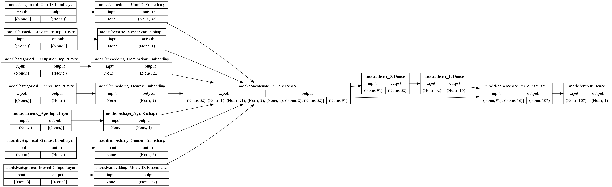

# Wide_and_Deep-tf2
It's an unofficial implementation of Wide&Deep in TensorFlow 2.0+.

Original Paper: ["Wide & Deep Learning for Recommender Systems"](https://arxiv.org/abs/1606.07792)

# Introduction

***Memorization (Wide Model)*** can be loosely defined as learning the frequent co-occurrence of items of features and exploiting the correlation available in historical data.

***Generalization (Deep Model)*** is based on transitivity of correlation and explores new feature combinations that have never or rarely occurred in the past.

Wide & Deep learning—jointly trained wide linear models and deep neural networks—to combine the benefits of memorization and generalization for recommender systems.

The implementation in original paper is useed for app recommender system productionized on Google Play. In this practice, we use [MovieLens 1m](https://grouplens.org/datasets/movielens/1m/) as training dataset.

### The sepectrum of Wide & Deep model in the original paper


### Our TensorFlow implementation of the Wide & Deep model



# Requirements
Python 3.8+
```sh
$ pip install -r requirements.txt
```

# Reference
* https://arxiv.org/abs/1606.07792
* https://grouplens.org/datasets/movielens/1m/
* https://keras.io/examples/structured_data/wide_deep_cross_networks/
* https://github.com/floraxhuang/Movie-Recommendation-System/blob/master/Deep%20and%20Wide%20Model.ipynb

# Future work
- [ ] Achieve better performance on MoiveLens dataset 